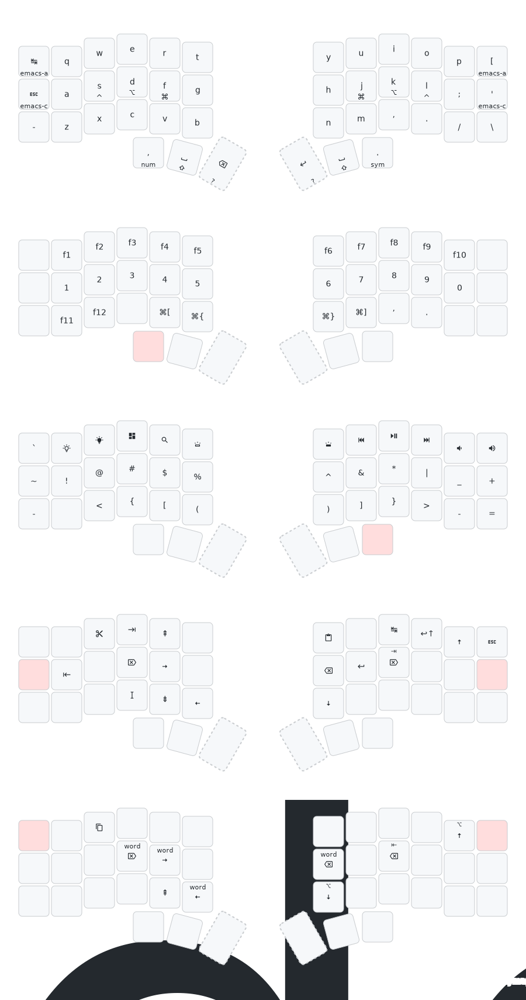

### KMonad config

- Install KMonad [Installation guide](https://github.com/kmonad/kmonad/blob/master/doc/installation.md)
- Skip sudo password `echo "$(whoami) ALL=(root) NOPASSWD: sha256:$(which kmonad | sha256) $(which kmonad)" | pbcopy && sudo visudo -f /private/etc/sudoers.d/kmonad`
- Run with certain config `nohup sudo kmonad path/to/keymap.kbd > /dev/null &`
- Now you can close terminal and KMonad will work in the background

#### Keymap:

